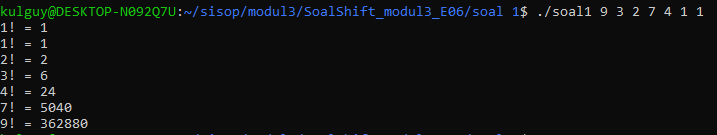
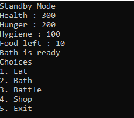
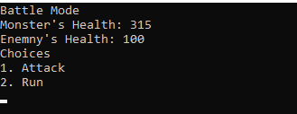
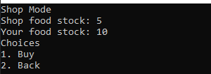
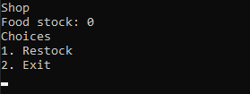

# Soal Shift Modul 3 (Kelompok E6)

###### Nama Anggota :
1. Ifta Jihan Nabila (05111740000034)
2. Komang Yogananda MW (05111740000114)

**Penjelasan Soal Shift Modul 2 Sistem Operasi 2019:**
* [Soal 1](#Soal-1)
* [Soal 2](#Soal-2)
* [Soal 3](#Soal-3)
* [Soal 4](#Soal-4)
* [Soal 5](#Soal-5)

## Soal-1
Buatlah program C yang bisa menghitung faktorial secara parallel lalu menampilkan hasilnya secara berurutan  
Contoh:  
    ./faktorial 5 3 4  
    3! = 6  
    4! = 24  
    5! = 120 
      
**_Jawaban:_** 

```c
int arg[500];
pthread_t thread[500];
int status;
```
Pendeklarasian variabel **arg**, **thread**, dan **status**. Variable **arg** untuk menampung argument program, **thread** adalah thread yang digunakan untuk menghitung nilai faktorial masing masing dan **status** digunakan sebagai penanda agar saat mencetak output terurut.

```c
void *factorial(void *num){
	long long ans = 1;
	int fak = *((int *)num);
	pthread_t id = pthread_self();
	for (int i = 1; i <= fak; i++){
		ans = ans * i;
	}
	while (!pthread_equal(id, thread[status]));
	printf("%d! = %lld\n",fak, ans);
	status++;
}
```
Fungsi **faktorial** digunakan untuk menghitung nilai faktorial dari **num**. Faktorial dihitung menggunakan perulangan dari 1 hingga n.  
`while (!pthread_equal(id, thread[status]));` potongan kode tersebut digunakan agar setiap thread yang berjalan paralel mencetak output sesuai dengan antriannya (dari yang paling kecil) dengan memanfaatkan variabel **status**.

```c
int main(int argc, char **argv){
    	for (int i = 1; i < argc; ++i){
		arg[i-1] = atoi(argv[i]);
	}
	status = 0;
	qsort(arg, argc-1, sizeof(int), cmpfunc);
	for (int i = 0; i < argc-1; i++) {
		int err = pthread_create(&(thread[i]), NULL, &factorial, &(arg[i]));
		if (err != 0){
			printf("\n can't create thread for factorial %d : [%s]",arg[i], strerror(err));
		}
	}
	for (int i = 0; i < argc-1; i++) pthread_join(thread[i], NULL);
	return 0;
}
```
- Fungsi `atoi` digunakan untuk mengkonversi string menjadi integer.
- Fungsi `qsort(arg, argc-1, sizeof(int), cmpfunc)` digunakan untuk mengurutkan argument agar terurut dari kecil ke besar. `qsort` mengambil argument `cmpfunc` yang berupa comparator.
- Fungsi `pthread_create(&(thread[i]), NULL, &factorial, &(arg[i]))` digunakan untuk mengassign sebuah thread untuk menghitung faktorial dari sebuah argument. Setiap argument memiliki 1 thread untuk menghitung nilai faktorialnya.

**_Hasil_**  



## Soal-2
Pada suatu hari ada orang yang ingin berjualan 1 jenis barang secara private, dia memintamu membuat program C dengan spesifikasi sebagai berikut:  
- Terdapat 2 server: server penjual dan server pembeli
- 1 server hanya bisa terkoneksi dengan 1 client  
- Server penjual dan server pembeli memiliki stok barang yang selalu sama  
- Client yang terkoneksi ke server penjual hanya bisa menambah stok  
    - Cara menambah stok: client yang terkoneksi ke server penjual mengirim string “tambah” ke server lalu stok bertambah 1  
- Client yang terkoneksi ke server pembeli hanya bisa mengurangi stok  
    - Cara mengurangi stok: client yang terkoneksi ke server pembeli mengirim string “beli” ke server lalu stok berkurang 1  
- Server pembeli akan mengirimkan info ke client yang terhubung dengannya apakah transaksi berhasil atau tidak berdasarkan ketersediaan stok  
    - Jika stok habis maka client yang terkoneksi ke server pembeli akan mencetak “transaksi gagal”  
    - Jika stok masih ada maka client yang terkoneksi ke server pembeli akan mencetak “transaksi berhasil”  
- Server penjual akan mencetak stok saat ini setiap 5 detik sekali  
- Menggunakan thread, socket, shared memory

## Soal-5
Angga, adik Jiwang akan berulang tahun yang ke sembilan pada tanggal 6 April besok. Karena lupa menabung, Jiwang tidak mempunyai uang sepeserpun untuk membelikan Angga kado. Kamu sebagai sahabat Jiwang ingin membantu Jiwang membahagiakan adiknya sehingga kamu menawarkan bantuan membuatkan permainan komputer sederhana menggunakan program C. Jiwang sangat menyukai idemu tersebut. Berikut permainan yang Jiwang minta.   
- Pemain memelihara seekor monster lucu dalam permainan. Pemain dapat  memberi nama pada monsternya.  
- Monster pemain memiliki hunger status yang berawal dengan nilai 200 (maksimalnya) dan nanti akan berkurang 5 tiap 10 detik.Ketika hunger status mencapai angka nol, pemain akan kalah. Hunger status dapat bertambah 15 apabila pemain memberi makan kepada monster, tetapi banyak makanan terbatas dan harus beli di Market.  
- Monster pemain memiliki hygiene status yang berawal dari 100 dan nanti berkurang 10 tiap 30 detik. Ketika hygiene status mencapai angka nol, pemain akan kalah. Hygiene status' dapat bertambah 30 hanya dengan memandikan monster. Pemain dapat memandikannya setiap 20 detik(cooldownnya 20 detik).  
- Monster pemain memiliki health status yang berawal dengan nilai 300. Variabel ini bertambah (regenerasi)daa 5 setiap 10 detik ketika monster dalam keadaan standby.
Monster pemain dapat memasuki keadaan battle. Dalam keadaan ini, food status(fitur b), hygiene status'(fitur c), dan ‘regenerasi’(fitur d) tidak akan berjalan. Health status dari monster dimulai dari darah saat monster pemain memasuki battle. Monster pemain akan bertarung dengan monster NPC yang memiliki darah 100. Baik monster pemain maupun NPC memiliki serangan sebesar 20. Monster pemain dengan monster musuh akan menyerang secara bergantian. 
- Fitur shop, pemain dapat membeli makanan sepuas-puasnya selama stok di toko masih tersedia.
    - Pembeli (terintegrasi dengan game)
        - Dapat mengecek stok makanan yang ada di toko.
        - Jika stok ada, pembeli dapat membeli makanan.
    - Penjual (terpisah)
        - Bisa mengecek stok makanan yang ada di toko
        - Penjual dapat menambah stok makanan.  

Spesifikasi program:
1. Program mampu mendeteksi input berupa key press. (Program bisa berjalan tanpa perlu menekan tombol enter)
2. Program terdiri dari 3 scene yaitu standby, battle, dan shop.
3. Pada saat berada di standby scene, program selalu menampilkan health status, hunger status, hygiene status, stok makanan tersisa, dan juga status kamar mandi (“Bath is ready” jika bisa digunakan, “Bath will be ready in [bath cooldown]s” jika sedang cooldown). Selain itu program selalu menampilkan 5 menu, yaitu memberi makan, mandi, battle, shop, dan exit. Contoh :  
Standby Mode  
Health : [health status]  
Hunger : [hunger status]  
Hygiene : [hygiene status]  
Food left : [your food stock]  
Bath will be ready in [cooldown]s  
Choices  
    1. Eat  
    2. Bath  
    3. Battle  
    4. Shop  
    5. Exit  

4. Pada saat berada di battle scene, program selalu menampilkan health status milik pemain dan monster NPC. Selain itu, program selalu menampilkan 2 menu yaitu serang atau lari. Contoh :  
Battle Mode  
Monster’s Health : [health status]  
Enemy’s Health : [enemy health status]  
Choices  
    1. Attack
    2. Run

5. Pada saat berada di shop scene versi pembeli, program selalu menampilkan food stock toko dan milik pemain. Selain itu, program selalu menampilkan 2 menu yaitu beli dan kembali ke standby scene. Contoh :  
Shop Mode  
Shop food stock : [shop food stock]  
Your food stock : [your food stock]  
Choices  
    1. Buy
    2. Back

6. Pada program penjual, program selalu menampilkan food stock toko. Selain itu, program juga menampilkan 2 menu yaitu restock dan exit. Contoh :  
Shop  
Food stock : [shop food stock]  
Choices  
    1. Restock
    2. Exit

7. Pastikan terminal hanya mendisplay status detik ini sesuai scene terkait (hint: menggunakan system(“clear”))

**_Jawaban_**

Terdapat 2 program yaitu  
1. Program game
2. Shop

Untuk program game
```c
typedef struct T_monster{
    char *nama;
    int hunger_status;
    int hygiene_status;
    int health_status;
}Monster;

Monster* Monster_new(char *nama){
    Monster* newMonster = (Monster*)malloc(sizeof(Monster));
    newMonster->nama = nama;
    newMonster->hunger_status = 200;
    newMonster->hygiene_status = 100;
    newMonster->health_status = 300;
}
```
Struktur **Monster** memiliki **nama**, **hunger_status**, **hygiene_status**, **health_status**.  
Fungsi `Monster_new(char *nama)` untuk menginsisialisasi monster dengan return type berupa pointer **Monster**.

Kemudian terdapat fungsi timer berupa **hungerStatusTimer**, .
```c
void *hungerStatusTimer(void *arg){
    int timeNow = 1;
    Monster *player = (Monster *)arg;
    while(1){
        timeNow = timeNow % 10;
        if (timeNow == 0){
            player->hunger_status = player->hunger_status - 5;
            if (player->hunger_status <= 0) alive = 0;
        }
        timeNow++;
        sleep(1);
    }
}

void *hygieneStatusTimer(void *arg){
    int timeNow = 1;
    Monster *player = (Monster *)arg;
    while(1){
        timeNow = timeNow % 30;
        if (timeNow == 0){
            player->hygiene_status = player->hygiene_status - 10;
            if (player->hygiene_status <= 0) alive = 0;
        }
        timeNow++;
        sleep(1);
    }
}

void *healthStatusTimer(void *arg){
    int timeNow = 1;
    Monster *player = (Monster *)arg;
    while(1){
        if (gameMode == 1){
            timeNow = timeNow % 10;
            if (timeNow == 0){
                player->health_status = player->health_status + 5;
            }
            timeNow++;
            sleep(1);
        }else{
            continue;
        }
    }
}
```
Fungsi - fungsi tersebut bertugas sebagai timer untuk mengurangi nilai - nilai dari monster sesuai dengan nama fungsinya sepert **hunger_status**, **hygiene_status**, **health_status**. Fungsi sleep setiap 1 detik untuk mensimulasikan timer 1 detik.   
Untuk fungsi **hungerStatusTimer** dan **healthStatusTimer** di modulus 10 artinya setiap 10 detik melakukan perhitungan sedangkan **hygieneStatusTimer** di modulus 30 artinya setiap 30 detik melakukan perhitungan.

```c
void *cooldown(void *arg){
    int *cd = (int *)arg;
    while(1){
        sleep(1);
        *cd = *cd - 1;
        if (*cd == 0) break;
    }
}
```
Fungsi **cooldown** digunakan untuk menghitung cooldown dari suatu aksi (contohnya Cooldown dari Bath).  
Fungsi tersebut mengambil nilai dari variabel cooldown dan mengambilnya sebagai argumen fungsi tersebut. Fungsi tersebut menggunakan pass by pointer sehingga merubah nilai cooldown pada fungsi tersebut akan merubah nilai asli dari variabel cooldown yang bersangkutan.

Kemudian terdapat fungsi **printMenu** yang digunakan untuk mencetak menu dari game sesuai dengan **gameMode** yang sedang berjalan.  
Pada program game kami variabel **gameMode** memiliki beberapa kemungkinan nilai yaitu:  
- gameMode = 1. Standby Mode
- gameMode = 2. Battle Mode
- gameMode = 3. Shop Mode
```c
void *printMenu(void *arg){
    Monster *player = (Monster*)arg;
    while(1){
        if (gameMode == 1){
            printf("Standby Mode\n");
            printf("Health : %d\n", player->health_status);
            printf("Hunger : %d\n", player->hunger_status);
            printf("Hygiene : %d\n", player->hygiene_status);
            printf("Food left : %d\n", foodStock); //shared memory
            if (bathCooldown == 0){
                printf("Bath is ready\n");
            }else{
                printf("Bath will be ready in %ds\n", bathCooldown);
            }
            printf("Choices\n");
            printf("1. Eat\n");
            printf("2. Bath\n");
            printf("3. Battle\n");
            printf("4. Shop\n");
            printf("5. Exit\n");
        }else if (gameMode == 2){
            printf("Battle Mode\n");
            printf("Monster's Health: %d\n", player->health_status);
            printf("Enemny's Health: %d\n", healthEnemy);
            printf("Choices\n");
            printf("1. Attack\n");
            printf("2. Run\n");
        }else if (gameMode == 3){
            printf("Shop Mode\n");
            printf("Shop food stock: %d\n", *shopStock);
            printf("Your food stock: %d\n", foodStock);
            printf("Choices\n");
            printf("1. Buy\n");
            printf("2. Back\n");
        }
        sleep(1);
        system("clear");
    }    
}
```
Fungsi tersebut akan di `sleep(1)` agar program mencetak menu setiap 1 detik.

Kemudian pada fungsi main.
```c
int main(){
    char nama[100];
    int shmid = shmget(key, sizeof(int), IPC_CREAT | 0666);
    shopStock = shmat(shmid, NULL, 0);
    printf("Masukkan nama monster: ");
    scanf("%s", nama);
    gameMode = 1;
    Monster *player = Monster_new(nama);
    bathCooldown = 0;
    system("clear");
    pthread_create(&menu, NULL, &printMenu, (void *)player);
    pthread_create(&hunger, NULL, &hungerStatusTimer, (void *)player);
    pthread_create(&health, NULL, &healthStatusTimer, (void *)player);
    pthread_create(&hygiene, NULL, &hygieneStatusTimer, (void *)player);
    healthEnemy = 100;
    alive = 1;
    foodStock = 10;
    *shopStock = 5;
    changemode(1);
    while(1){
        while(!kbhit()){
            if (gameMode == 1){
                char c = getchar();
                if (c == '3'){
                    gameMode = 2;
                }else if (c == '5'){
                    shmdt(shopStock);
                    shmctl(shmid, IPC_RMID, NULL);
                    changemode(0);
                    return 0;
                }else if (c == '1'){
                    if (foodStock > 0){
                        foodStock--;
                        player->hunger_status = player->hunger_status + 15;
                    }
                }else if (c == '2'){
                    player->hygiene_status = player->hygiene_status + 30;
                    bathCooldown = 20;
                    pthread_create(&bath, NULL, &cooldown, (void*)&bathCooldown);
                }else if (c == '4'){
                    gameMode = 3;
                }
            }else if (gameMode == 2){
                char c = getchar();
                if (c == '1'){
                    healthEnemy = healthEnemy - 20;
                    if (healthEnemy <= 0){
                        healthEnemy = 0;
                        gameMode = 1;
                        healthEnemy = 100;
                        continue;
                    }
                    player->health_status = player->health_status - 20;
                    if (player->health_status <= 0){
                        alive = 0;
                    }
                }else if (c == '2'){
                    gameMode = 1;
                    healthEnemy = 100;
                }
            }else if (gameMode == 3){
                char c = getchar();
                if (c == '1'){
                    if (shopStock > 0){
                        foodStock++;
                        *shopStock = *shopStock - 1;
                    }
                }else if (c == '2'){
                    gameMode = 1;
                }
            }
        }
        if (alive == 0){
            printf("Monster mati\n");
            shmdt(shopStock);
            shmctl(shmid, IPC_RMID, NULL);
            changemode(0);
            return 0;
        }
    }
    shmdt(shopStock);
    shmctl(shmid, IPC_RMID, NULL);
    changemode(0);
    return 0;
}
```

Detailnya
```c
key_t key = 1000;

int shmid = shmget(key, sizeof(int), IPC_CREAT | 0666);
shopStock = shmat(shmid, NULL, 0);
```
Potongan program tersebut digunakan untuk mengambil memori dengan key 1000. Nilai alamat dari memori dengan key tersebut disimpan dalam variabel **shopStock**.

4 fungsi `pthread_create` digunakan untuk
```c
pthread_create(&menu, NULL, &printMenu, (void *)player);
pthread_create(&hunger, NULL, &hungerStatusTimer, (void *)player);
pthread_create(&health, NULL, &healthStatusTimer, (void *)player);
pthread_create(&hygiene, NULL, &hygieneStatusTimer, (void *)player);
```
1. thread **menu** diberikan untuk menjalankan fungsi **printMenu**
2. thread **hunger** diberikan untuk menjalankan fungsi **hungerStatusTimer**
3. thread **health** diberikan untuk menjalankan fungsi **healthStatusTimer**
4. thread **hygiene** diberikan untuk menjalankan fungsi **hygieneStatusTimer**

```c
if (foodStock > 0){
    foodStock--;
    player->hunger_status = player->hunger_status + 15;
}
```
Kemudian potongan code diatas digunakan untuk mensimulasikan command `Eat`.
```c
player->hygiene_status = player->hygiene_status + 30;
bathCooldown = 20;
pthread_create(&bath, NULL, &cooldown, (void*)&bathCooldown);
```
Potongan code diatas digunakan untuk memberikan cooldown pada bathCooldown.
```c
char c = getchar();
if (c == '1'){
    healthEnemy = healthEnemy - 20;
    if (healthEnemy <= 0){
        healthEnemy = 0;
        gameMode = 1;
        healthEnemy = 100;
        continue;
    }
    player->health_status = player->health_status - 20;
    if (player->health_status <= 0){
        alive = 0;
    }
}else if (c == '2'){
    gameMode = 1;
    healthEnemy = 100;
}
```
Potongan code diatas digunakan untuk mensimulasikan battle mode.

```c
char c = getchar();
if (c == '1'){
    if (shopStock > 0){
        foodStock++;
        *shopStock = *shopStock - 1;
    }
}else if (c == '2'){
    gameMode = 1;
}
```
Potongan code diatas digunakan untuk mensimulasikan shop pada player.
```c
if (alive == 0){
    printf("Monster mati\n");
    shmdt(shopStock);
    shmctl(shmid, IPC_RMID, NULL);
    changemode(0);
    return 0;
}
```
Potongan program diatas digunakan untuk memeriksa setiap saat apakah monster masih hidup atau tidak dengan bantuan variabel **alive**.

Untuk program shop
```c
void *printMenu(void *arg){
    int *stock = (int *)arg;
    while(1){
        printf("Shop\n");
        printf("Food stock: %d\n", *stock);
        printf("Choices\n");
        printf("1. Restock\n");
        printf("2. Exit\n");
        sleep(1);
        system("clear");
    }    
}
```
Sama halnya fungsi printMenu pada program game, fungsi printMenu pada program shop digunakan untuk mencetak menu setiap detiknya.
```c
int main(){
    key_t key = 1000;
    int *stock;

    int shmid = shmget(key, sizeof(int), IPC_CREAT | 0666);
    stock = shmat(shmid, NULL, 0);
    pthread_create(&menu, NULL, &printMenu, (void *)stock);
    changemode(1);
    while(1){
        while(!kbhit()){
            char c = getchar();
            if (c == '1'){
                *stock = *stock + 1;
            }else if (c == '2'){
                shmdt(stock);
                shmctl(shmid, IPC_RMID, NULL);
                changemode(0);
                return 0;
            }
        }
    }
    shmdt(stock);
    shmctl(shmid, IPC_RMID, NULL);
    changemode(0);
    return 0;
}
```
Kemudian pada fungsi main.
```c
key_t key = 1000;
int *stock;

int shmid = shmget(key, sizeof(int), IPC_CREAT | 0666);
stock = shmat(shmid, NULL, 0);
```
Pada potongan ini digunakan untuk mengambil memori dengan key 1000 dan disimpan dalam variabel stock.  
`pthread_create(&menu, NULL, &printMenu, (void *)stock)`
Kemudian thread menu diberikan tugas untuk menjalankan fungsi **printMenu**.  

`*stock = *stock + 1;`
baris ini digunakan untuk menambah stock pada memori dengan key 1000.

**_Hasil_**  
  
  
   
